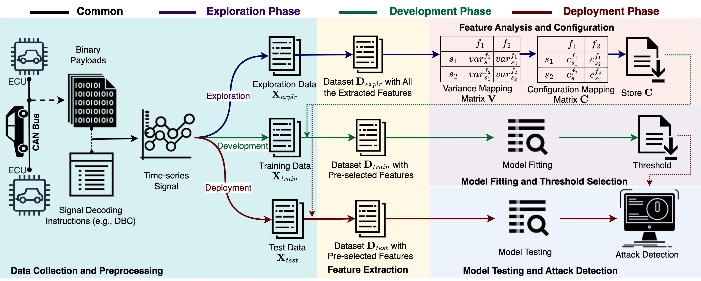

# cantropy
CANtropy: Time Series Feature Extraction-Based Intrusion Detection Systems for Controller Area Networks

This repository provides the python implementation of CANtropy, a manual feature engineering-based lightweight CAN IDS. For each signal, CANtropy explores a comprehensive set of features from both temporal and statistical domains and selects only the effective subset of features in the detection pipeline to ensure scalability. Later, CANtropy uses a lightweight unsupervised anomaly detection model based on principal component analysis, to learn the mutual dependencies of the features and detect abnormal patterns in the sequence of CAN messages. The evaluation results on the advanced SynCAN dataset show that CANtropy provides a comprehensive defense against diverse types of cyberattacks.




## Clone cantropy

```
git clone https://github.com/shahriar0651/cantropy.git
cd cantropy
```

## Install Mambaforge
#### Download and Install Mambaforge
```
wget https://github.com/conda-forge/miniforge/releases/latest/download/Mambaforge-$(uname)-$(uname -m).sh
chmod +x Mambaforge-$(uname)-$(uname -m).sh
./Mambaforge-$(uname)-$(uname -m).sh
```
#### Create Environment
```
conda env create --file dependency/environment.yaml
```
Or update the existing env
```
conda env update --file dependency/environment.yaml --prune
```

#### Activate Environment
```
conda activate cantropy
```

## Download Dataset

#### Download SynCAN and ROAD Datasets

```
cd src

chmod +x download_syncan_dataset.sh
./download_syncan_dataset.sh

chmod +x download_road_dataset.sh
./download_road_dataset.sh
```

#### Create Symbolic Link (Optional)
If you have the the datasets downloaded (or want to download) outside of the repo, you can create a symbolic link to show the those dataset folders wihtin the repository. To create symbolic link from the repository's directory:

```
cd <directory_to_cantropy>
ln -s <directory_to_syncan_dataset>/ datasets/
ln -s <directory_to_road_dataset>/ datasets/
```

For example, if `/home/workspace/can-ids-datasets/` folder contains the SynCAN and ROAD dataset, you can follow:
```
cd cantropy
ln -s /home/workspace/can-ids-datasets/syncan datasets
ln -s /home/workspace/can-ids-datasets/road datasets
```

Here is the folder structure of the repository: 
```
.
├── config
│   ├── road.yaml
│   └── syncan.yaml
├── datasets
│   └── road
│   └── syncan
├── dependency
│   ├── environment.yaml
│   └── requirements.txt
├── doc
│   └── cantropy_workflow.jpg
├── LICENSE
├── README.md
├── scaler
│   ├── min_max_values_road.csv
│   ├── min_max_values_syncan.csv
└── src
    ├── dataset
    ├── helpers
    ├── download_road_dataset.sh
    ├── download_syncan_dataset.sh
    ├── run_feature_analysis.py
    └── run_feature_extraction.py
```
Here is the detailed tree structure of the datasets folder (after you download both of them):

```
.
└── datasets
    └── can-ids
        ├── road
        │   ├── ambient
        │   ├── attacks
        │   ├── data_table.csv
        │   ├── readme.md
        │   └── signal_extractions
        │       ├── ambient
        │       │   ├── ambient_dyno_drive_basic_long.csv
        │       │   ├── ambient_dyno_drive_basic_short.csv
        │       │   ├── ambient_dyno_drive_benign_anomaly.csv
        │       │   ├── ambient_dyno_drive_extended_long.csv
        │       │   ├── ambient_dyno_drive_extended_short.csv
        │       │   ├── ambient_dyno_drive_radio_infotainment.csv
        │       │   ├── ambient_dyno_drive_winter.csv
        │       │   ├── ambient_dyno_exercise_all_bits.csv
        │       │   ├── ambient_dyno_idle_radio_infotainment.csv
        │       │   ├── ambient_dyno_reverse.csv
        │       │   ├── ambient_highway_street_driving_diagnostics.csv
        │       │   ├── ambient_highway_street_driving_long.csv
        │       ├── attacks
        │       │   ├── accelerator_attack_drive_1.csv
        │       │   ├── accelerator_attack_drive_2.csv
        │       │   ├── accelerator_attack_reverse_1.csv
        │       │   ├── accelerator_attack_reverse_2.csv
        │       │   ├── correlated_signal_attack_1_masquerade.csv
        │       │   ├── correlated_signal_attack_2_masquerade.csv
        │       │   ├── correlated_signal_attack_3_masquerade.csv
        │       │   ├── max_engine_coolant_temp_attack_masquerade.csv
        │       │   ├── max_speedometer_attack_1_masquerade.csv
        │       │   ├── max_speedometer_attack_2_masquerade.csv
        │       │   ├── max_speedometer_attack_3_masquerade.csv
        │       │   ├── metadata.json
        │       │   ├── reverse_light_off_attack_1_masquerade.csv
        │       │   ├── reverse_light_off_attack_2_masquerade.csv
        │       │   ├── reverse_light_off_attack_3_masquerade.csv
        │       │   ├── reverse_light_on_attack_1_masquerade.csv
        │       │   ├── reverse_light_on_attack_2_masquerade.csv
        │       │   └── reverse_light_on_attack_3_masquerade.csv
        │       └── DBC
        └── syncan
            ├── ambients
            │   ├── train_1.csv
            │   ├── train_2.csv
            │   ├── train_3.csv
            │   └── train_4.csv
            ├── attacks
            │   ├── test_continuous.csv
            │   ├── test_flooding.csv
            │   ├── test_plateau.csv
            │   ├── test_playback.csv
            │   └── test_suppress.csv
            ├── License terms.txt
            └── README.md
```
## Implementing cantropy

#### Feature Extraction
```python
python run_feature_extraction.py --config-name <dataset_name> -m data_type=training,testing
```

  - For Example: 
    ```python
    python run_feature_extraction.py --config-name syncan -m data_type=training,testing

    python run_feature_extraction.py --config-name road -m data_type=training,testing
    ```

#### Feature Analysis and Evaluation
```python
python run_feature_analysis.py --config-name <dataset_name>
```

- For Example: 
  ```python
  python run_feature_analysis.py --config-name syncan

  python run_feature_analysis.py --config-name road
  ```

### Unit Test
- To run the scripts on a smaller fraction of dataset add the argument ```fraction=<any fraction within 0.0 to 1.0>```
- For instance, to run the scripts on the first 10% of the data points (both training and testing):
  
  ```python
  python run_feature_extraction.py --config-name syncan -m data_type=training,testing fraction=0.10
  python run_feature_analysis.py --config-name syncan fraction=0.10
  ```

    ```python
  python run_feature_extraction.py --config-name road -m data_type=training,testing fraction=0.10
  python run_feature_analysis.py --config-name road fraction=0.10
  ```
  
### Visualization and Results

- The figures are saved in `artificts/figures` folder.
- The results are saved in `artificts/results` folder.

  
## Citation
```bibtex
@inproceedings{shahriar2023cantropy,
  title={CANtropy: Time series feature extraction-based intrusion detection systems for controller area networks},
  author={Shahriar, Md Hasan and Lou, Wenjing and Hou, Y Thomas},
  booktitle={Proceedings of Symposium on Vehicles Security and Privacy (VehicleSec)},
  pages={1--8},
  year={2023},
  doi={https://dx.doi.org/10.14722/vehiclesec.2023.23090}
}
```
